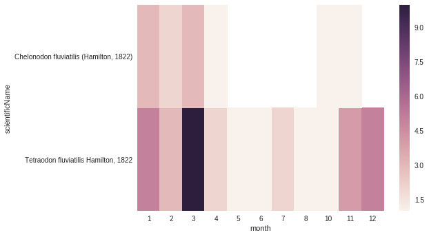

Interaction with Pandas Package
~~~~~~~~~~~~~~~~~~~~~~~~~~~~~~~
.. warning::

    You'll need to `install Pandas <http://pandas.pydata.org/pandas-docs/stable/install.html>`_ first.

`Pandas`_ is a powerful data analysis package that provides the user a large set of functionalities, such as easy
slicing, filtering, calculating and summarizing statistics or plotting.

Python-dwca-reader exposes a :meth:`pd_read` method to easily load the content of a data file (core or extension)
from the archive into a Pandas `DataFrame`_.

.. code:: python

   from dwca.read import DwCAReader

   with DwCAReader('gbif-results.zip') as dwca:
      print("Core data file is: {}".format(dwca.descriptor.core.file_location)) # => 'occurrence.txt'

      core_df = dwca.pd_read('occurrence.txt', parse_dates=True)

      # All Pandas functionalities are now available on the core_df DataFrame

.. note::

    :meth:`DwCAReader.pd_read` is a simple wrapper around
    `pandas.read_csv() <https://pandas.pydata.org/pandas-docs/stable/generated/pandas.read_csv.html>`_ and accept the same
    optional arguments. Only a few of them (`delimiter`, `skiprows`, `encoding`, ...) will be ignored because DwCAReader
    sets them appropriately for the data file.

.. note::

    Alternatively, you can do `core_df = dwca.pd_read(dwca.core_file_location, ...)` which is handy if you don't know
    the name of the core data file.

As a small example, some applications on the ``core_df``:

.. warning::

    You'll need to `install Seaborn <https://seaborn.pydata.org/installing.html>`_ for this example.

.. code:: python

    import pandas as pd
    import seaborn as sns

    # Number of records for each institutioncode
    core_df["institutionCode"].value_counts()

    # Select the coordinate information of the first twenty records
    core_df.loc[:20, ["decimalLatitude", "decimalLongitude"]]

    # Count the number of records with date information after 1950
    sum(core_df["year"] > 1950)

    # Convert eventDate to DateTime python object
    core_df['eventDate'] = pd.to_datetime(core_df['eventDate'])

    # Select only those records with coordinates, not (0, 0) coordinates and eventDate provided
    core_df[(core_df["decimalLatitude"] != 0.0) &
            (core_df["decimalLatitude"].notnull()) &
            (core_df["decimalLongitude"] != 0.0) &
            (core_df["decimalLongitude"].notnull()) &
            (core_df["eventDate"].notnull())]

    # Count the number of records for each species for each month
    count_occ = core_df.pivot_table(index="scientificName",
                                    columns="month",
                                    values="id",
                                    aggfunc='count')
    # Visualisation of the counts on a heatmap (Seaborn)
    sns.heatmap(count_occ)

For more information about `Pandas`_ and `Seaborn`_, see their respective documentation.

.. _Pandas: http://pandas.pydata.org/pandas-docs/stable/
.. _Seaborn: https://seaborn.pydata.org/
.. _DataFrame: https://pandas.pydata.org/pandas-docs/stable/generated/pandas.DataFrame.html

When the DwCA contains multiple files, joining the extensions with the core file could be of interest for further
analysis.

.. code:: python

    import pandas as pd
    from dwca.read import DwCAReader

    with DwCAReader('dwca-2extensions.zip') as dwca:
        # Check the core file of the Archive  (Occurrence, Taxon, ...)
        print("Core type is: {}".format(dwca.descriptor.core.type))

        # Check the available extensions
        print("Available extensions: {}".format([ext.split("/")[-1] for ext in dwca.descriptor.extensions_type]))

        taxon_df = dwca.pd_read('taxon.txt')
        descr_df = dwca.pd_read('description.txt')
        vern_df = dwca.pd_read('vernacularname.txt')

    # Join the information of the description and vernacularname extension to the core taxon information
    # (cfr. database JOIN)
    taxon_df = pd.merge(taxon_df, descr_df, left_on='id', right_on='coreid', how="left")
    taxon_df = pd.merge(taxon_df, vern_df, left_on='id', right_on='coreid', how="left")

The result is the core file joined with the extension files. More information about the Pandas merge is provided in the
`documentation`_.

.. _documentation: http://pandas.pydata.org/pandas-docs/stable/generated/pandas.DataFrame.merge.html

**Remark** that reading in the data to Pandas will load the entire file into memory. For large archives, this won't be
feasible. Pandas support the usage of chunks, reading in a processing the data in chunks. As an example, consider the
selection of those occurrences for which the ``eventDate`` was a Sunday:

.. code:: python

    import pandas as pd
    from dwca.read import DwCAReader

    chunksize = 10 # Chosen chunksize to process the data (pick a larger value for real world cases)
    with DwCAReader('gbif-results.zip') as dwca:
        sunday_occ = []
        for chunk in dwca.pd_read('occurrence.txt', chunksize=chunksize):
            chunk['eventDate'] = pd.to_datetime(chunk['eventDate'])

            # Subselect only the records recorded on a sunday
            sunday_occ.append(chunk[chunk['eventDate'].dt.weekday == 6]) # Monday = 0, Sunday = 6

    sunday_occ = pd.concat(sunday_occ)

More advanced processing is supported by Pandas. However, when only interested in counting the number of occurrences for
a specific condition, Pandas is not always required. As an example, counting the number of occurrences for each species
in the data set is easily supported by the ``Counter`` datatype of Python:

.. code:: python

    from collections import Counter

    from dwca.read import DwCAReader
    from dwca.darwincore.utils import qualname as qn

    with DwCAReader('/Users/nicolasnoe/Desktop/gbif-results.zip') as dwca:
        count_species = Counter()

        for row in dwca:
            count_species.update([row.data[qn('scientificName')]])

        print(count_species)

Hence, the added value of Pandas depends on the type of analysis. Some more extensive applications of Pandas to work
with Darwin Core data is provided in this `data cleaning`_ tutorial and `data analysis`_ tutorial.

.. _data cleaning: https://github.com/jorisvandenbossche/DS-python-data-analysis/blob/master/_solved/case2_biodiversity_cleaning.ipynb
.. _data analysis: https://github.com/jorisvandenbossche/DS-python-data-analysis/blob/master/_solved/case2_biodiversity_analysis.ipynb