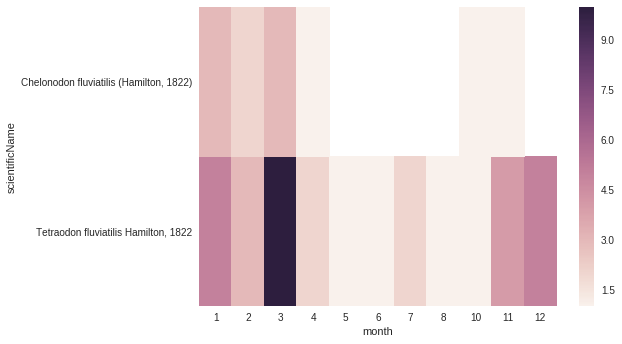

Tutorial
========

Installation
------------

Quite simply:

::
    
    $ pip install python-dwca-reader

Example uses
------------

Basic use, access to metadata and data from the Core file
~~~~~~~~~~~~~~~~~~~~~~~~~~~~~~~~~~~~~~~~~~~~~~~~~~~~~~~~~

.. code:: python

    from dwca.read import DwCAReader
    from dwca.darwincore.utils import qualname as qn

    # Let's open our archive...
    # Using the with statement ensure that resources will be properly freed/cleaned after use.
    with DwCAReader('my-archive.zip') as dwca:
        # We can now interact with the 'dwca' object

        # We can read scientific metadata (EML) through a xml.etree.ElementTree.Element object in the 'metadata'
        # attribute.
        dwca.metadata

        # The 'descriptor' attribute gives access to the Archive Descriptor (meta.xml) and allow
        # inspecting the archive:
        # For example, discover what the type the Core file is: (Occurrence, Taxon, ...)
        print("Core type is: %s" % dwca.descriptor.core.type)
        # => Core type is: http://rs.tdwg.org/dwc/terms/Occurrence

        # Check if a Darwin Core term in present in the core file
        if 'http://rs.tdwg.org/dwc/terms/locality' in dwca.descriptor.core.terms:
            print("This archive contains the 'locality' term in its core file.")
        else:
            print("Locality term is not present.")

        # Using full qualnames for DarwincCore terms (such as 'http://rs.tdwg.org/dwc/terms/country') is verbose...
        # The qualname() helper function make life easy for common terms.
        # (here, it has been imported as 'qn'):
        qn('locality')
        # => u'http://rs.tdwg.org/dwc/terms/locality'

        # Combined with previous examples, this can be used to things more clear:
        # For example:
        if qn('locality') in dwca.descriptor.core.terms:
            pass

        # Or:
        if dwca.descriptor.core.type == qn('Occurrence'):
            pass

        # Finally, let's iterate over the archive core rows and get the data:
        for row in dwca:
            # row is an instance of CoreRow
            # iteration respects their order of appearance in the core file

            # Print() can be used for debugging purposes...
            print(row)

            # => --
            # => Rowtype: http://rs.tdwg.org/dwc/terms/Occurrence
            # => Source: Core file
            # => Row ID:
            # => Data: {u'http://rs.tdwg.org/dwc/terms/basisOfRecord': u'Observation', u'http://rs.tdwg.org/dwc/terms/family': # => u'Tetraodontidae', u'http://rs.tdwg.org/dwc/terms/locality': u'Borneo', u'http://rs.tdwg.#
            # => org/dwc/terms/scientificName': u'tetraodon fluviatilis'}
            # => --

            # You can get the value of a specific Darwin Core term through
            # the "data" dict:
            print("Value of 'locality' for this row: %s" % row.data[qn('locality')])
            # => Value of 'locality' for this row: Mumbai

        # Alternatively, we can get a list of core rows instead of iterating:
        # BEWARE: all rows will be loaded in memory!
        rows = dwca.rows

        # Or retrieve a specific row by its id:
        occurrence_number_three = dwca.get_row_by_id(3)

        # Caution: ids are generally a fragile way to identify a core row in an archive, since the standard dosn't guarantee unicity (nor even that there will be an id).
        # the index (position) of the row (starting at 0) is generally preferable.

        occurrence_on_second_line = dwca.get_row_by_index(1)

        # We can retreive the (absolute) of embedded files
        # NOTE: this path point to a temporary directory that will be removed at the end of the DwCAReader object life cycle.
        path = dwca.absolute_temporary_path('occurrence.txt')

Access to Darwin Core Archives with extensions (star schema)
~~~~~~~~~~~~~~~~~~~~~~~~~~~~~~~~~~~~~~~~~~~~~~~~~~~~~~~~~~~~

.. code:: python

    from dwca.read import DwCAReader

    with DwCAReader('archive_with_vernacularnames_extension.zip') as dwca:
        # Let's ask the archive what kind of extensions are in use:
        for e in dwca.descriptor.extensions:
            print(e.type)
        # => http://rs.gbif.org/terms/1.0/VernacularName

        first_core_row = dwca.rows[0]

        # Extension rows are accessible from a core row as a list of ExtensionRow instances:
        for extension_line in first_core_row.extensions:
            # Display all rows from extension files reffering to the first Core row
            print(extension_line)

Another example with multiple extensions (no new API here)
~~~~~~~~~~~~~~~~~~~~~~~~~~~~~~~~~~~~~~~~~~~~~~~~~~~~~~~~~~

.. code:: python

    from dwca.read import DwCAReader

    with DwCAReader('multiext_archive.zip') as dwca:
        rows = dwca.rows
        ostrich = rows[0]

        print("You'll find below all extensions rows reffering to Ostrich")
        print("There should be 3 vernacular names and 2 taxon description")
        for ext in ostrich.extensions:
            print(ext)

        print("We can then simply filter by type...")
        for ext in ostrich.extensions:
            if ext.rowtype == 'http://rs.gbif.org/terms/1.0/VernacularName':
                print(ext)

Interaction with Pandas Package
~~~~~~~~~~~~~~~~~~~~~~~~~~~~~~~
The `Pandas Package`_ is a powerful data analysis package, with a specific focus on DataFrames. The conversion from the infidivual core and extension files into Pandas DataFrames provides the user a large set of functionalities, such as easy slicing, filtering, calculating summarizing statistics or plotting.

.. _Pandas Package: http://pandas.pydata.org/

The easiest way to load the core file as a DataFrame, is to read in the file from the archive. 

.. code:: python

   import pandas as pd
   from dwca.read import DwCAReader

   with DwCAReader('gbif-results.zip') as dwca:
      # Check the core file of the Archive  (Occurrence, Taxon, ...)
      print("Core type is: {}".format(dwca.descriptor.core.type))

      # As the core file is an Occurrence, stored in temporary folder
      occurrence_path = dwca.absolute_temporary_path('occurrence.txt')

      # There's a descriptor object that gives details about occurrence.txt
      # Those details will be needed by pd.read_csv
      occurrence_descriptor = dwca.descriptor.core

      # read the core data file as a DataFrame
      core_df = pd.read_csv(occurrence_path,
                            delimiter=occurrence_descriptor.fields_terminated_by,
                            skiprows=occurrence_descriptor.lines_to_ignore,
                            names=occurrence_descriptor.short_headers,
                            header=None,

                            parse_dates=True)

      # All Pandas functionalities are now available on the core_df DataFrame

As a small example, some applications on the ``core_df``:

.. code:: python

    # Number of records for each institutioncode
    core_df["institutionCode"].value_counts()

    # Select the coordinate information of the first twenty records
    core_df.loc[:20, ["decimalLatitude", "decimalLongitude"]]

    # Count the number of records with date information after 1950 
    sum(core_df["verbatimYear"] > 1950)

    # Convert eventDate to DateTime python object
    core_df['eventDate'] = pd.to_datetime(core_df['eventDate'])

    # Select only those records with coordinates, not (0, 0) coordinates and eventDate provided
    core_df[(core_df["decimalLatitude"] != 0.0) & 
            (core_df["decimalLatitude"].notnull()) &
            (core_df["decimalLongitude"] != 0.0) & 
            (core_df["decimalLongitude"].notnull()) & 
            (core_df["eventDate"].notnull())]

    # Count the number of records for each species for each month
    count_occ = core_df.pivot_table(index="scientificName", 
                                    columns="month", 
                                    values="id", 
                                    aggfunc='count')
    # Visualisation of the counts on a heatmap (Seaborn)
    sns.heatmap(count_occ)

For more information about `Pandas`_ and `Seaborn`_, see their respective documentation. 

.. _Pandas: http://pandas.pydata.org/pandas-docs/stable/
.. _Seaborn: https://seaborn.pydata.org/

When the DwCA contains multiple files, joining the extensions with the core file could be of interest for further analysis.

.. code:: python

    import pandas as pd
    from dwca.read import DwCAReader

    with DwCAReader('dwca-2extensions.zip') as dwca:

        # Check the core file of the Archive  (Occurrence, Taxon, ...)
        print("Core type is: {}".format(dwca.descriptor.core.type))

        # As the core file is an Occurrence, stored in temporary folder
        core_path = dwca.absolute_temporary_path('taxon.txt')

        # read the core as dataframe (with header)
        taxon_df = pd.read_csv(core_path, delimiter="\t")

        # Check the available extensions
        print("Available extensions: {}".format([ext.split("/")[-1] for ext in dwca.descriptor.extensions_type]))

        # Load the description extension
        descr_path = dwca.absolute_temporary_path('description.txt')
        descr_df = pd.read_csv(descr_path, delimiter="\t")

        # Load the VernacularName extension
        vern_path = dwca.absolute_temporary_path('vernacularname.txt')
        vern_df = pd.read_csv(vern_path, delimiter="\t")

    # Join the information of the description and vernacularname extension to the core taxon information
    # (cfr. database JOIN)
    taxon_df = pd.merge(taxon_df, descr_df, on='id', how="left")
    taxon_df = pd.merge(taxon_df, vern_df, on='id', how="left")

The result is the core file joined with the extension files. More information about the Pandas merge is provided in the `documentation`_.

.. _documentation: http://pandas.pydata.org/pandas-docs/stable/generated/pandas.DataFrame.merge.html

**Remark** that reading in the data to Pandas will load the entire file into memory. For large archives, this won't be feasible. Pandas support the usage of chunks, reading in a processing the data in chunks. As an example, consider the selection of those occurrences for which the ``eventDate`` was a Sunday:

.. code:: python

    import pandas as pd
    from dwca.read import DwCAReader
    from collections import Counter

    chunksize = 10 # Chosen chunksize to process the data (pick a larger value for real world cases)
    with DwCAReader('gbif-results.zip') as dwca:

        # As the core file is an Occurrence, stored in temporary folder
        path = dwca.absolute_temporary_path('occurrence.txt')

        sunday_occ = []
        for chunk in pd.read_csv(path, delimiter="\t", header=None, 
                                parse_dates=True, chunksize=chunksize):

            # Get the header names from the DwCAReader headers
            chunk.columns = dwca.descriptor.core.short_headers
            chunk['eventDate'] = pd.to_datetime(chunk['eventDate'])

            # Subselect only the records recorded on a sunday
            sunday_occ.append(chunk[chunk['eventDate'].dt.weekday == 6]) # Monday = 0, Sunday = 6

    sunday_occ = pd.concat(sunday_occ)

More advanced processing is supported by Pandas. However, when only interested in counting the number of occurrences for a specific condition, Pandas is not always required. As an example, counting the number of occurrences for each species in the data set is easily supported by the ``Counter`` datatype of Python:

.. code:: python

    from collections import Counter

    with DwCAReader('gbif-results.zip') as dwca:

        # As the core file is an Occurrence, stored in temporary folder
        path = dwca.absolute_temporary_path('occurrence.txt')

        count_species = Counter()
        for row in dwca:
            count_species.update([row.data[qn('scientificName')]])

Hence, the added value of Pandas depends on the type of analysis. Some more extensive applications of Pandas to work with Darwin Core data is provided in this `data cleaning`_ tutorial and `data analysis`_ tutorial.

.. _data cleaning: https://github.com/jorisvandenbossche/DS-python-data-analysis/blob/master/_solved/case2_biodiversity_cleaning.ipynb
.. _data analysis: https://github.com/jorisvandenbossche/DS-python-data-analysis/blob/master/_solved/case2_biodiversity_analysis.ipynb

GBIF Downloads
~~~~~~~~~~~~~~

The GBIF website allow visitors to export occurrences as a Darwin Core Archive. The resulting file contains a few more things that are not part of the `Darwin Core Archive`_ standard. These additions also works with python-dwca-reader. See :doc:`gbif_results` for explanations on the file format and how to use it.

.. _Darwin Core Archive: http://en.wikipedia.org/wiki/Darwin_Core_Archive